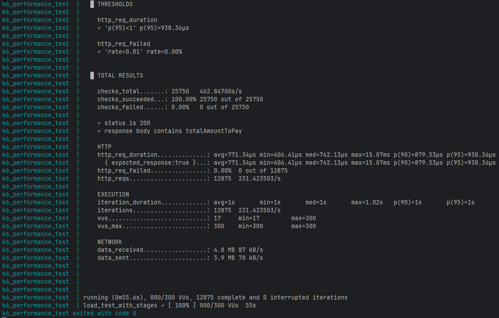
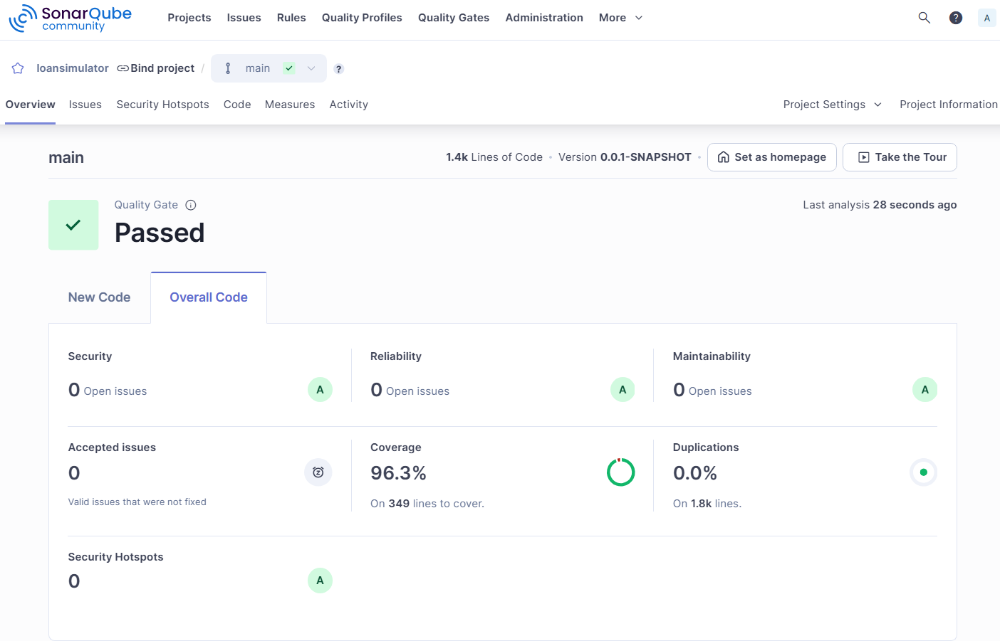
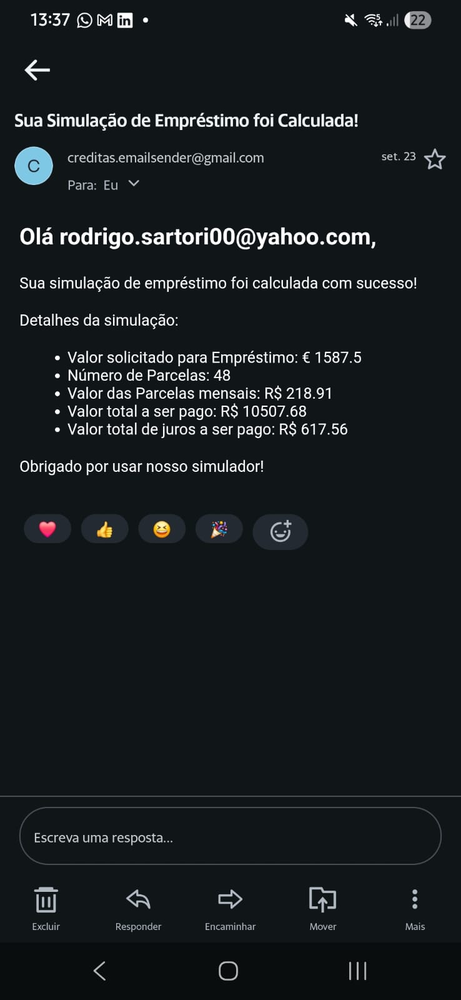

<div align="center">

# Challenge Engenharia de Software - Creditas


<br><br>


<br><br>

<br>


</div>

<div align="center">

# 💵 Loan Simulator 💵
Esta Aplicação implementa um Simulador de Empréstimos utilizando calculo de parcelas fixas, este calculo é amplamente
utilizado para determinar o valor das prestações mensais em empréstimos ou financiamentos que utilizam o Sistema Price 
(ou Tabela Price), onde as parcelas são constantes. 

Após o cálculo e o envio da resposta ao consumidor da request, a simulação é persistida no banco de dados e uma 
notificação é enviada ao e-mail do solicitante.

## 💻 Sobre o desafio

O objetivo do desafio é construir uma API para Simulação de empréstimos, que seja permormática, utilize boas práticas de
desenvolvimento, seja bem documentado, tenha testes automatizados e que tenha um endpoint que aceite multiplas simulações 
de crédito em uma única requisição.

Entenda mais sobre o desafio Backend [aqui](./assets/_Backend__Case_de_Código.pdf)
</div>


## 👌 Desafio System Design

Entenda mais sobre o desafio System Design [aqui](./assets/_SÊNIOR__System_Design.pdf)

Veja minha resolução do desafio de System Design [aqui](./SystemDesign.md)

## 💫 Arquitetura da solução
- O software foi implementado utilizando Clean Architecture para promover baixo acoplamento entre as dependencias externas, 
Use Cases e dominio da aplicação.
- Foi amplamente utilizado conceitos de pararelismo e processamento assincrono para obter uma melhor performance 
principalmente no endpoint para multiplas simulações, aproveitando-se de utilização de Virtual Threads do Java 21.
- Foi implementado um SQS para o envio das notificações por e-mail para ganharmos em resiliência, tolerancia a falhas, 
escalabilidade independente da aplicação principal e em caso de pico, a fila SQS atua como um "buffer".
- Para ganharmos em velocidade de entrega do calculo ao consumidor da request, a persistencia no banco e a postagem de 
mensagem notificação por e-mail na fila são feitas async após o termino da requisição.

### Estrutura do projeto
```
src/

└── main/

├── java/
│   └── br/com/creditas/loansimulator/
│       ├── application/                                        # Lógica de negócio e casos de uso
│       │   ├── exceptions/                                     # Exceções específicas da aplicação
│       │   │   ├── BusinessException.java
│       │   │   └── UnsupportedAgeException.java
│       │   ├── gateway/                                        # Interfaces para gateways externos
│       │   │   └── exchange/                                   # Interface de serviço para obter a taxa de câmbio
│       │   │       └── ExchangeRateService.java
│       │   └── usecase/                                        # Definições dos casos de uso
│       │       ├── impl/                                       # Implementações dos casos de uso
│       │       │   ├── LoanMultipleSimulatorUseCaseImpl.java
│       │       │   └── LoanSimulatorUseCaseImpl.java
│       │       ├── LoanMultipleSimulatorUseCase.java
│       │       └── LoanSimulatorUseCase.java
│       ├── domain/                                             # O coração da lógica de negócio
│       │   ├── model/                                          # Modelos de domínio e enums
│       │   │   ├── enums/
│       │   │   │   └── Currency.java
│       │   │   ├── LoanSimulation.java
│       │   │   └── Person.java
│       │   ├── service/                                        # Serviços de domínio
│       │   │   └── FixedPaymentCalculator.java
│       │   └── strategy/                                       # Implementações de estratégias de domínio (Strategy Pattern)
│       │       ├── impl/
│       │       │   ├── FirstRangeStrategy.java
│       │       │   ├── FourthRangeStrategy.java
│       │       │   ├── SecondRangeStrategy.java
│       │       │   ├── ThirdRangeStrategy.java
│       │       └── RangesStrategy.java
│       ├── infrastructure/                                     # Configurações e implementações de infraestrutura
│       │   ├── config/                                         # Configurações gerais da infraestrutura
│       │   │   ├── async/                                      # Configurações gerais da infraestrutura
│       │   │   │   ├── asyncConfig.java
│       │   │   │   └── WebClientConfig.java
│       │   │   ├── bean/                                       # Configurações de beans Spring
│       │   │   │   ├── service/
│       │   │   │   │   └── FixedPaymentCalculatorConfig.java
│       │   │   │   ├── strategy/
│       │   │   │   │   ├── FirstRangeStrategyConfig.java
│       │   │   │   │   ├── FourthRangeStrategyConfig.java
│       │   │   │   │   ├── SecondRangeStrategyConfig.java
│       │   │   │   │   └── ThirdRangeStrategyConfig.java
│       │   │   │   └── usecase/
│       │   │   │       ├── LoanMultipleSimulatorUseCaseConfig.java
│       │   │   │       └── LoanSimulatorUseCaseConfig.java
│       │   │   ├── database/                                   # Implementações relacionadas a banco de dados
│       │   │   │   └── AuditorAwareImpl.java
│       │   │   ├── openapi/                                    # Configurações para OpenAPI/Swagger
│       │   │   │   └── SpringDocConfigurations.java
│       │   │   ├── properties/                                 # Configuração externalizada de taxas por range de idade
│       │   │   │   └── RateRanges.java
│       │   │   └── queue/                                      # Configurações de fila AWS SQS)
│       │   │       └── AwsSqsConfig.java
│       │   ├── entrypoint/                                     # Pontos de entrada da aplicação (APIs, Consumers)
│       │   │   ├── consumer/                                   # Consumers de mensagens (SQS)
│       │   │   │   ├── config/
│       │   │   │   │   └── ObjectMapperConfig.java
│       │   │   │   └── SendEmailNotificationConsumer.java 
│       │   │   └── controller/                                 # Controladores REST da API
│       │   │       ├── handler/                                # Controlador de Error Handler
│       │   │       │   ├── dto/
│       │   │       │   │   ├── ErrorsValidateDataResponseDTO.java
│       │   │       │   │   └── ProblemResponseDTO.java
│       │   │       │   └── ControllerAdvice.java               # Tratamento global de exceções
│       │   │       ├── loan/                                   # Controladores específicos para empréstimos
│       │   │       │   ├── dto/
│       │   │       │   │   ├── LoanSimulationRequestDto.java
│       │   │       │   │   ├── LoanSimulationResponseDto.java
│       │   │       │   │   ├── PersonRequestDto.java
│       │   │       │   │   ├── PersonResponseDto.java
│       │   │       │   │   └── SimulateRequestedResponseDto.java
│       │   │       │   └── LoanController.java
│       │   │       └── openapi/                                # Controladores para documentação OpenAPI
│       │   │           └── LoanControllerOpenApi.java
│       │   ├── event/                                          # Componentes para publicação/inscrição de eventos (Observer Pattern)
│       │   │   ├── publisher/
│       │   │   │   ├── impl/                                   # Publicador de eventos
│       │   │   │   │   └── EventPublisherImpl.java
│       │   │   │   └── EventPublisher.java
│       │   │   ├── subscriber/                                 # Incrição de eventos
│       │   │   │   ├── SaveOnDbSubscriber.java
│       │   │   │   └── SendEmailSubscriber.java
│       │   │   └── NewLoanCalculatedObservable.java
│       │   └── gateway/                                        # Gateways externos 
│       │       ├── currency/                                   # Serviço para obter a taxa de câmbio
│       │       │   ├── client/
│       │       │   │   ├── dto/
│       │       │   │   │   ├── CurrencyExchangeRateDto.java
│       │       │   │   │   └── CurrencyPriceDto.java        
│       │       │   │   └── CurrencyExchangeRateClient.java
│       │       │   ├── CurrencyExchangeRateScheduler.java      # Scheduler que roda em background para obter taxas de câmbio
│       │       │   └── ExchangeRateServiceImpl.java
│       │       ├── database/                                   # Classes relacionadas a persistencia em banco de dados
│       │       │   ├── entity/
│       │       │   │   ├── AuditEntity.java
│       │       │   │   ├── LoanSimulationEntity.java
│       │       │   │   └── PersonEntity.java     
│       │       │   ├── persistence/
│       │       │   │   ├── impl/
│       │       │   │   │   ├── LoanSimulationPersistenceImpl.java
│       │       │   │   │   └── PersonPersistenceImpl.java     
│       │       │   │   ├── LoanSimulationPersistence.java
│       │       │   │   └── PersonPersistence.java     
│       │       │   └── repository/
│       │       │       ├── LoanSimulationEntityRepository.java
│       │       │       └── PersonEntityRepository.java     
│       │       ├── email/                                      # Adaptador para envio de e-mails
│       │       │   ├── impl/
│       │       │   │   └── MailServiceAdapterImpl.java
│       │       │   └── MailServiceAdapter.java
│       │       └── producer/                                   # Produtor de mensagens SQS para envio async de email
│       │           ├── config/
│       │           │   └── JacksonConfig.java
│       │           ├── notification/
│       │           │   └── impl/
│       │           │       ├── dto/
│       │           │       │   └── EmailNotificationDTO.java    
│       │           │       └── EmailNotificationProducerImpl.java
│       │           └── EmailNotificationProducer.java
│       └── LoanSimulatorApplication.java                       # Start method da aplicação  
└── resources/
    ├── db/
    │   └── migration/                                          # Migrations de banco de dados
    │       └── V1__initial-tables.sql
    ├── application.properties                                  # Propriedades do aplicativo
    └── rate.properties                                         # Propriedades externalizadas de taxas por range de idade
```
<br>

## 🚀 Como executar o projeto

### Pré-requisitos

É necessário ter o serviço [Docker](https://www.docker.com/products/docker-desktop/) iniciado para utilizar a aplicação.

#### 🎲 Iniciando o App

```bash
# A aplicação está containerizada então somente execute o comando na raiz do projeto: 
docker compose up

# este Docker Compose irá subir:
# - A aplicação na porta 8090 
# - Um database PostgreSQL na porta 5432 
# - Um localstack na porta 4566
```

#### ✨ Exemplo das requisições

```bash

# Requisição para realizar a simulação de um único empréstimo

curl -X 'POST' \
  'http://localhost:8090/v1/loan' \
  -H 'accept: application/json' \
  -H 'Content-Type: application/json' \
  -d '{
  "currency": "EUR",
  "loanAmount": 1587.5,
  "qtInstallments": 48,
  "person": {
    "document": "40857607855",
    "birthDay": "1955-05-05",
    "email": "93sartori@gmail.com"
  }
}'

# Requisição para realizar a simulação de multiplos empréstimos

curl --request POST \
  --url http://localhost:8090/v1/loan/batch \
  --header 'Content-Type: application/json' \
  --header 'User-Agent: insomnia/2023.5.8' \
  --data '[
  {
    "currency":"EUR",
    "loanAmount":"1587.5",
    "qtInstallments":"48",
    "person": {
        "document":"40857607855",
        "birthDay":"1993-05-05",
        "email":"93sartori@gmail.com"
    }
  },
  {
    "currency":"BRL",
    "loanAmount":"10000",
    "qtInstallments":"36",
    "person": {
        "document":"67606010099",
        "birthDay":"2001-05-05",
        "email":"93sartori@gmail.com"
    }
  },
  {
    "currency":"BRL",
    "loanAmount":"15000",
    "qtInstallments":"24",
    "person": {
        "document":"94829138092",
        "birthDay":"1955-05-05",
        "email":"93sartori@gmail.com"
    }
  },
  {
    "currency":"USD",
    "loanAmount":"20000",
    "qtInstallments":"24",
    "person": {
        "document":"22236059078",
        "birthDay":"1974-05-05",
        "email":"93sartori@gmail.com"	
    }
  }
]'
```

### 💡 E o caso com 10mil simulações em uma única request?

Caso queira testar o endpoint /loan/batch com 10mil requisições, [clique aqui](./assets/curl-batch.sh)

## 📄 Documentação da API (Swagger)

Todos os endpoints estão documentados no Swagger da aplicação, a documentação está disponível em:

- http://localhost:8090/swagger-ui/index.html

## 🧪 Executando os Testes

- Foi implementado testes unitários em todas as classes com regra de negócio.

#### Execução dos testes

```bash
mvn test
```
## ⚡ Teste de Desempenho

### 💥 Configuração

- O teste foi configurado no K6 para fazer uma rampa de 300VUs em 15s, segurar estes 30VUs durante 30s e declinar a 0VUs em 10 segundos
- Os thresholds foram configurados para tolerancia de 1% de falha nas requests e a duração do p(95) até 1ms

### 💥 Como reproduzir o teste
```bash
# Dentro do diretorio k6 tem um Docker Compose que sobe um K6 já com o script carregado. 
# Certifique que a aplicação está rodando!

cd k6
docker compose up
```

### 💥 Resultado do teste

- São feitas 12875 requisições em 55 segundos sem nenhuma falha nas requests e com o p(95) em 938µs.


## 📊 Análise de Qualidade com SonarQube

### Executando a Análise
A análise de qualidade foi executada utilizando SonarQube para garantir alta qualidade do código:

```bash

# Crie um container utilizando o docker-compose.yml disponível em sonar/docker-compose.yml
cd sonar
docker compose up

- Acesse o painel do Sonar no navegador: "http://localhost:9000"
- O usuário e senha padrão é admin / admin (ele pedira para trocar a senha na primeira vez).
- Clique em "Create Project" e depois em "Local project"
- Digite "loansimulator" no campo "Project display name" (o mesmo se refletira para o campo Project Key)
- Clique em "next"
- Marque "Use the global setting" e clique em "Create Project"
- Clique em "Locally"
- Clique em "Generate"
- Clique em "Continue" e em "Maven"
- O Sonarqube irá te fornecer um comando parecido com o comando abaixo, execute-o na raiz do projeto
- O Resultado da análise estará disponível no painel do Sonarqube

mvn clean verify sonar:sonar \
  -Dsonar.projectKey=loansimulator \
  -Dsonar.projectName='loansimulator' \
  -Dsonar.host.url=http://localhost:9000 \
  -Dsonar.token=SEUTOKEN
```

### Resultado da Análise



## 💡 Highlights do Desafio

**1 -** Todos os desafios específicos para Sênior foram entregues
- Implementado um endpoint que aceita múltiplas simulações de crédito em uma única requisição (ex: 10.000 simulações).
- Utilizado técnicas de paralelismo e/ou processamento assíncrono para melhorar a performance.
- Aplicado serviço de mensageria em uma funcionalidade.
- Documentação Swagger está disponível na aplicação.

**2 -** Foi entregue 3 sugestões de bonus:
- Implementado notificação por email com os resultados da simulação.
- Criado um Dockerfile e docker-compose para facilitar o setup da aplicação.
- Adicionado suporte para diferentes moedas e conversão de taxas.

**3 -** Pensando em boas práticas de desenvolvimento de software, foi implementado os seguintes Design Patterns:

**4 -** Utilizado o Maven Spotless como linter para manter a consistência do código

- **Strategy**: Utilizado para selecionar a regra de taxa que melhor se adapta de acordo com a idade posibilitando a extensão futura para outras regras.
- **Interceptor**: Utilizado ControllerAdvice para interceptar exceptions e transforma-las em responses amigáveis para
   o consumidor da API.
- **Observer**: Utilizado ApplicationEventPublisher para desacoplamento dos componentes, permitindo que observadores reajam
   conforme necessário, permitindo facil manutenção / evolução.


**5 -** Documentação [Swagger](http://localhost:9090/swagger-ui/index.html) personalizada para as necessidades da aplicação.

**6 -** +80 testes unitários automatizados cobrindo mais de 90% da aplicação.

**7 -** Utilizado fortemente os princípios KISS, YAGNI, DRY e SOLID.

**8 -** Utilização de Conventional Commits como padrão para os commits.

**9 -** Dockerfile criado em multi-stage nos beneficiando de: </span>
- **Custos Reduzidos**, multi-stage elimina até 76% do peso desnecessário ocupando menos espaço no storage do servidor em que ficará alocado
- **Segurança aprimorada**, uma vez que o container não contem código fonte e JDK, diminui a área de ataque
- **Deploy mais rápido**, pois pipelines rodarm mais rapido e PODs iniciarão mais rapido

**10 -** Template de e-mail funcional.



## 🙃 Disclaimers:

### 1 - Envio de notificações por e-mail:

- O Gmail pessoal tem um ratelimit de quantas requisições podem ser feitas, por tanto, em determinados momentos, após
muitas simulações de empréstimo, o SMTP deixa de funcionar, criei um e-mail creditas.emailsender@gmail.com e deixei a 
password dela disponível para utilização no Docker Compose, para que todas as requisições efetivamente sejam notificadas
por email deve-se utilizar um SMTP mais robusto para envio de e-mails.

### 2 - Vulnerabilidade OpenAPI:

- Foi encontrada a vulnerabilidade [CVE-2025-48924](https://nvd.nist.gov/vuln/detail/CVE-2025-48924) na dependancia
  "springdoc-openapi-starter-common" e até o momento não há uma correção disponível,
  já foi aberto uma [ISSUE](https://github.com/springdoc/springdoc-openapi/issues/3093) no GitHub do SpringDoc para
  tratamento deste assunto.
- Assim que houver uma correção irei atualizar a versão utilizada neste projeto.
