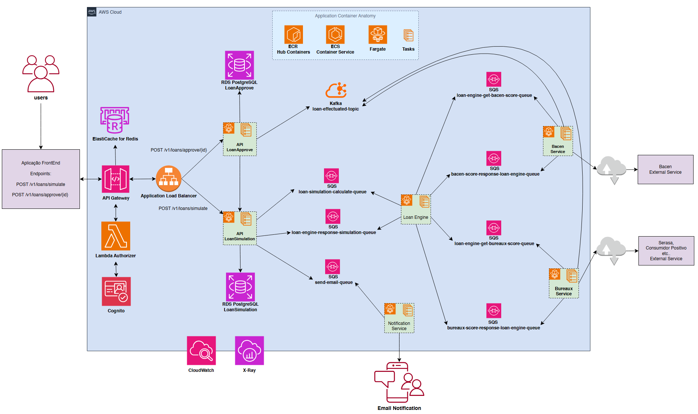

# 💡 Desafio System Design

## 💻 Sobre o desafio

O desafio consiste em projetar a arquitetura de um sistema de simulação e proposta de empréstimos. O sistema deve 
permitir que os usuários façam simulações de empréstimos com base em um conjunto de dados fornecidos, e que o sistema 
gere propostas personalizadas de empréstimos.

Entenda mais sobre o desafio System Design [aqui](./assets/_SÊNIOR__System_Design.pdf)

## ✨ Proposta de Solução

### Desenho da Arquitetura:


O system design foi projetado para lidar com a simulação e aprovação de empréstimos, utilizando uma abordagem de microsserviços, 
comunicação assíncrona e serviços gerenciados na AWS para garantir alta disponibilidade, escalabilidade e resiliência.

## 📜 Explicação

### 1 - Inicio

- No início temos uma aplicação FrontEnd que será responsável por realizar as seguintes requisições quando o usuário solicitar:
  - POST /v1/loans/simulate
  - POST /v1/loans/approve/{id}

### 2 - API Gateway e Application Load Balancer (ALB)
- O **API Gateway** atua como o ponto de entrada unificado para as requisições do frontend, roteando-as para os 
microsserviços apropriados.
- O **Application Load Balancer** distribui o tráfego de entrada de forma eficiente entre as instâncias dos microsserviços, 
garantindo que a carga seja balanceada e que o sistema possa lidar com picos de tráfego.

### 3 - Lambda Authorizer e Cognito

- **Cognito** gerencia a autenticação e autorização dos usuários, cuidando do registro, login e gerenciamento de sessões.
- **Lambda Authorizer** é uma função serverless que intercepta as requisições no API Gateway para validar os tokens 
de autenticação gerados pelo Cognito, garantindo que apenas usuários autorizados acessem os recursos do backend.

### 4 - Microsserviços (APIs, Loan Engine, Bacen Service, Bureau Service, Notification Service)

Todas as aplicações de backend (como as APIs de simulação e aprovação, o Loan Engine, os serviços de Bacen e Bureaux, 
e o Notification Service) são implantadas em **Clusters ECS (Elastic Container Service) utilizando o Fargate**. 
Isso significa que a AWS gerencia a infraestrutura subjacente (servidores), permitindo que você se concentre apenas no 
código da sua aplicação, com escalabilidade automática e pagamento apenas pelos recursos consumidos.

- **API LoanSimulation:** Responsável por receber requisições de simulação. Para otimizar o desempenho, esta API utiliza
um **Redis para cachear as respostas** de simulações. Se uma requisição de simulação com os mesmos parâmetros for feita 
novamente em um curto período, a resposta pode ser servida diretamente do cache, evitando o reprocessamento completo.

- **API LoanApprove**: Responsável por efetivar um empréstimo, recebendo o ID da simulação, consulta o id da proposta na
**API LoanSimulation**, efetua o emprestimo e posta no **tópico Kafka (`loan-effectuated-topic`)** para consumo de outros serviços.

- **Loan Engine:** É o serviço central que orquestra os cálculos de simulação, a avaliação de risco e o processamento de 
aprovações. Ele interage com os serviços de score de crédito e o banco de dados.

- **Bacen Service e Bureau Service:** Estes serviços são responsáveis por se comunicar com os **Serviços Externos** 
(Bacen, Serasa, Consumidor Positivo, etc.) para obter scores e informações de crédito. Eles atuam como adaptadores para
essas integrações.

- **Notification Service:** Encarregado de enviar notificações aos usuários, como e-mails sobre o status de suas 
propostas de empréstimo.

### 5 - RDS PostgreSQL
- É a camada de persistencia das aplicações, cada API tem o seu próprio banco de dados relacional gerenciado pela AWS (RDS)
que armazena de forma persistente todos os dados relacionados às simulações no caso de **API LoanSimulation** e 
aprovações de empréstimos no caso de **API LoanApprove**, garantindo a integridade e durabilidade das informações.

### 6 - SQS Queues (Simple Queue Service)

As filas SQS são usadas extensivamente para **comunicação assíncrona** entre os microsserviços. Isso desacopla os 
componentes, tornando o sistema mais resiliente a falhas e permitindo que os serviços processem as mensagens em seu próprio ritmo.

- `loan-simulation-calculate-queue`: Para enfileirar solicitações de cálculo de simulação.
- `loan-engine-response-simulation-queue`: Para o Loan Engine devolver os resultados das simulações.
- `loan-engine-get-bacen-score-queue` e `loan-engine-get-bureaux-score-queue`: Para solicitar aos serviços de score as 
informações do cliente.
- `bacen-score-response-loan-engine-queue` e `bureau-score-response-loan-engine-queue`: Para os serviços de score 
retornarem as informações do cliente ao Loan Engine.
- `send-email-queue`: Para enfileirar requisições de envio de e-mails para o Notification Service.

### 7 - Kafka (loan-effectuated-topic)

- Para eventos críticos e em tempo real, como a efetivação de um empréstimo, o sistema utiliza um **tópico Kafka (`loan-effectuated-topic`)**.
- Permitindo que outros sistemas ou microsserviços (como ilustrado BacenService e BureauxService) possam consumir esses 
eventos em tempo real para fins como contabilidade, relatórios ou integrações, garantindo uma propagação rápida e 
confiável de informações importantes.

### 8 - Monitoramento e Logging (CloudWatch e X-Ray)

- **CloudWatch:** Coleta métricas, logs e eventos de todos os serviços AWS, permitindo o monitoramento da saúde e 
desempenho do sistema, além da configuração de alertas.
- 
- **X-Ray:** Oferece **rastreamento distribuído**, permitindo visualizar o fluxo completo de uma requisição através 
de múltiplos microsserviços e filas, o que é fundamental para depurar problemas de desempenho e identificar gargalos 
em uma arquitetura distribuída.


## 💫 Pontos Mais Fortes da Arquitetura

### Alta Escalabilidade e Elasticidade

- **ECS Fargate:** Elimina a necessidade de gerenciar servidores, escalando automaticamente os contêineres conforme a 
demanda, otimizando o uso de recursos e custos.
- **ALB e SQS:** O balanceador de carga distribui o tráfego, enquanto as filas SQS absorvem picos de requisições, 
permitindo que os serviços processem mensagens em seu próprio ritmo sem sobrecarregar o sistema.
-  **Kafka:** Projetado para lidar com grandes volumes de eventos em tempo real, garantindo que a plataforma possa 
crescer com a demanda de eventos de empréstimos.

### Resiliência e Tolerância a Falhas

- **Microsserviços Desacoplados:** A falha em um serviço não derruba o sistema inteiro. A comunicação assíncrona via SQS
e Kafka isola os componentes, permitindo que falhas sejam contidas e que os serviços se recuperem independentemente.
- **Serviços Gerenciados AWS:** RDS, SQS, API Gateway, Fargate são serviços gerenciados que oferecem alta disponibilidade 
e redundância integradas.

### Performance Otimizada
- **Redis para Cache de Simulações:** Ao cachear resultados de simulações repetitivas, o sistema reduz significativamente
a latência para o usuário e a carga sobre os microsserviços de cálculo e o banco de dados.
- **Comunicação Assíncrona:** Libera o frontend e os serviços iniciais rapidamente, permitindo que o processamento pesado 
ocorra em segundo plano.

### Observabilidade Abrangente
- **CloudWatch e X-Ray:** Oferecem ferramentas poderosas para monitorar a saúde do sistema, coletar logs detalhados e, 
crucialmente, rastrear requisições através de múltiplos serviços, facilitando a identificação e resolução de problemas em um ambiente distribuído.

### Segurança Robusta
- **Cognito e Lambda Authorizer:** Fornecem um mecanismo sólido para autenticação e autorização de usuários, protegendo 
o acesso aos recursos do backend.
- **API Gateway:** Atua como uma primeira linha de defesa, permitindo controle de acesso e proteção contra ataques comuns.

## 🚧 API Design

### Endpoint Simulação de empréstimo
- **Endpoint:** `POST /v1/loans/simulate`
- **Descrição:** Este endpoint permite que um usuário solicite uma simulação de empréstimo com base em critérios fornecidos.
A requisição é processada pela `API LoanSimulation`. Para otimizar o desempenho, esta API utiliza um 
**Redis para cachear as respostas** de simulações. Se uma requisição com os mesmos parâmetros for feita novamente em um 
curto período, a resposta pode ser servida diretamente do cache, reduzindo a latência e a carga nos serviços de backend. 
Caso não haja cache, a requisição é enviada para a fila SQS `loan-simulation-calculate-queue`, onde o `LoanEngine` 
coordena a obtenção de scores de crédito (via BacenService e BureauxService) e calcula a proposta. 
O resultado final é retornado ao usuário após o processamento.

#### Exemplo de Request:
```bash
curl -X 'POST' \
  'http://host/v1/loans/simulate' \
  -H 'accept: application/json' \
  -H 'Content-Type: application/json' \
  -d '{
  "currency": "EUR",
  "loanAmount": 1587.5,
  "qtInstallments": 48,
  "person": {
    "document": "07062032751",
    "birthDay": "1993-05-05",
    "email": "fake@fake.com"
  }
}'
```

#### Exemplo de Response:
```json
{
  "id": "a55feb44-5895-49a5-a1bd-1e4cb3b8d895",
  "totalAmountToPay": 10507.68,
  "installmentAmount": 218.91,
  "totalInterest": 617.56,
  "person": {
    "document": "07062032751",
    "birthDay": "1993-05-05",
    "email": "fake@fake.com"
  },
  "simulationRequested": {
    "currency": "EUR",
    "loanAmount": 1587.5,
    "qtInstallments": 48
  }
}
```

### Endpoint Contratação de empréstimo
- **Endpoint:** `POST /v1/loans/approve/{id}`
- **Descrição:** Este endpoint é utilizado para formalizar a aprovação de uma proposta de empréstimo previamente simulada 
e aceita pelo usuário. O `{id}` refere-se ao `id` gerado após a simulação. Ao receber a requisição, a `API LoanApprove` 
interage com o `Loan Engine` para finalizar o processo de aprovação, que atualiza o status no RDS e publica um evento 
no tópico Kafka `loan-effectuated-topic` para notificar outros sistemassobre a efetivação do empréstimo. 

#### Exemplo de Request:
```bash
curl -X 'POST' \
  'http://host/v1/loans/approve/a55feb44-5895-49a5-a1bd-1e4cb3b8d895' \
  -H 'accept: application/json' \
  -H 'Content-Type: application/json' \
  -d '{
  "currency": "EUR",
  "loanAmount": 1587.5,
  "qtInstallments": 48,
  "person": {
    "document": "07062032751",
    "birthDay": "1993-05-05",
    "email": "fake@fake.com"
  }
}'
```

#### Exemplo de Response:
```json
{
  "simulationId": "a55feb44-5895-49a5-a1bd-1e4cb3b8d895",
  "status": "APPROVED",
  "loanDetails": {
    "approvedAmount": 1587.5,
    "installments": 48,
    "monthlyInstallmentValue": 218.91,
    "totalAmountToPay":10507.68
  },
  "message": "Successful approved loan proposal. A confirmation email has been sent."
}

```

## 🚀 Motor de Simulação de Empréstimos

O "Motor de Simulação de Empréstimos" (Loan Engine) será um microsserviço crucial na sua arquitetura, rodando em um 
Cluster ECS com Fargate. A eficiência aqui não se refere apenas à velocidade de cálculo, mas também à capacidade de 
escalar, ser resiliente e fornecer resultados precisos.

- O `Loan Engine` não recebe requisições diretamente do frontend. Em vez disso, ele consome mensagens da fila SQS 
`loan-simulation-calculate-queue`. Isso garante que o processamento seja assíncrono e resiliente, permitindo que 
o frontend responda rapidamente ao usuário enquanto o motor trabalha em segundo plano.


- Ao receber uma mensagem do SQS, o motor inicia um processo de orquestração.
  - **Validação de Dados:** Primeiramente, ele valida os dados de entrada (CPF, valor do empréstimo, número de parcelas, etc.) 
    para garantir que estejam no formato correto e dentro dos limites aceitáveis.
  - O `Loan Engine` envia requisições assíncronas para os microsserviços `Bacen Service` e `Bureau Service`. 
  Esses serviços, por sua vez, interagem com os **Serviços Externos** (Serasa, SPC, Bacen) para obter scores de crédito, 
  histórico financeiro e outras informações relevantes.
  - A comunicação com `Bacen Service` e `Bureaux Service` também pode ser feita via SQS 
   (por exemplo, `bacen-score-request-queue`, `bureau-score-request-queue`) para manter o desacoplamento. 
  As respostas seriam enviadas de volta para filas específicas (`bacen-score-response-loan-engine-queue`, 
  `bureau-score-response-loan-engine-queue`) que o `Loan Engine` monitora.
  - Com base nas informações de crédito e nos dados fornecidos pelo usuário, este módulo aplica as regras de negócio da 
  instituição financeira. Verifica se o solicitante atende aos critérios mínimos (idade, renda, score de crédito).
  - **Definição da Taxa de Juros:** Utiliza modelos de risco pré-definidos para determinar a taxa de juros mais adequada
  para o perfil de crédito do solicitante. 
  - Realiza os Calculos de acordo com as regras pré definidas e retorna na queue `loan-engine-response-simulation-queue`
- Importante ressaltar que é crucial usar tipos de dados que lidem com alta precisão para operações financeiras, como 
- `BigDecimal` em Java, em vez de `float` ou `double`, que podem introduzir erros de arredondamento.
